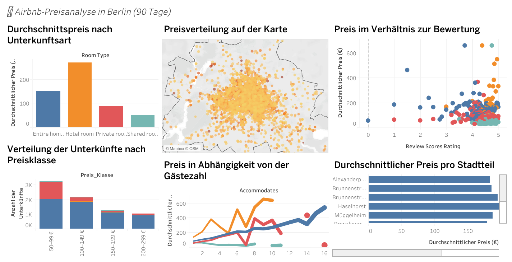

# Airbnb Preisanalyse in Berlin (90 Tage)

## 🧭 Projektübersicht
Dieses Projekt untersucht Airbnb-Preise in Berlin mithilfe von Python, SQL und Tableau.  
Ziel ist es, Muster in Preisgestaltung, Nachfrage und Unterkunftsarten zu erkennen.

Die Analyse basiert auf Airbnb-Daten (Listings und Calendar) und zeigt:
- Preisverteilung und Preisspannen
- Durchschnittspreise nach Unterkunftsart und Stadtteil
- Zusammenhang zwischen Preis, Bewertung und Kapazität
- Nachfrageindikator (Anteil der nicht verfügbaren Tage in 90 Tagen)

---

## 📁 Projektstruktur
<pre>
├── data
│   ├── raw
│   │   ├── listings.csv.gz
│   │   ├── calendar.csv.gz
│   │   └── neighbourhoods.geojson
│   └── processed
│       ├── listings_clean.csv
│       └── merged.csv
├── notebooks
│   ├── 01_peek.ipynb
│   ├── 02_clean.ipynb
│   ├── 03_demand.ipynb
│   └── 04_report.ipynb
├── sql
│   ├── berlin-airbnb-price-intel.db
│   ├── preis_statistik.sql
│   ├── preis_nach_unterkunftsart.sql
│   ├── preis_nach_stadtteil.sql
│   ├── preis_vs_kapazitaet.sql
│   ├── preis_vs_bewertung.sql
│   ├── numerische_uebersicht.sql
│   ├── tabelle_ueberblick.sql
│   └── ...
├── reports
│   └── figures
│       ├── price_hist.png
│       ├── price_by_neighbourhood_top12.png
│       ├── price_vs_accommodates.png
│       └── price_corr_top.png
├── Tableau
│   ├── Dashboard.twbx
│   └── Dashboard.png
├── README.md
├── requirements.txt
└── .gitignore

</pre>

---

## ⚙️ Datenaufbereitung (Python)
1. **Peek & Cleaning**
   - Entfernen leerer Spalten
   - Preise als numerische Werte (`price_eur`) konvertiert
   - Extreme Werte (1.–99. Perzentil) gecappt
   - Fehlende numerische Werte durch Median ersetzt

2. **Demand-Analyse**
   - 90-Tage-Periode aus Calendar-Daten
   - `unavailable_rate_90d` = Anteil der Tage, an denen ein Listing nicht verfügbar war

3. **Datenexport**
   - Gereinigte Tabellen gespeichert als:
     - `listings_clean.csv`
     - `merged.csv`

---

## 🧮 SQL-Analyse
Die wichtigsten Abfragen:
- Überblick und fehlende Werte
- Preisstatistik und Ausreißer
- Durchschnittspreis nach Unterkunftsart, Stadtteil, Bewertung
- Korrelationen zwischen numerischen Merkmalen

Datei: `sql/berlin-airbnb-price-intel.sqbpro`

---

## 📊 Tableau-Dashboard
**Titel:** *Airbnb-Preisanalyse in Berlin (90 Tage)*

**Diagramme:**
<table style="width:100%; border-collapse:collapse; font-family:system-ui, -apple-system, Segoe UI, Roboto, Arial, sans-serif;">
  <thead>
    <tr>
      <th style="text-align:left; padding:8px; border-bottom:1px solid #ddd;">Analyse / Diagramm</th>
      <th style="text-align:left; padding:8px; border-bottom:1px solid #ddd;">Verwendete Felder</th>
      <th style="text-align:left; padding:8px; border-bottom:1px solid #ddd;">Diagrammtyp</th>
    </tr>
  </thead>
  <tbody>
    <tr>
      <td style="padding:8px; border-bottom:1px solid #f0f0f0;">💰 <strong>Durchschnittspreis nach Unterkunftsart</strong></td>
      <td style="padding:8px; border-bottom:1px solid #f0f0f0;"><code>Room Type</code>, <code>AVG(Price Eur Num)</code></td>
      <td style="padding:8px; border-bottom:1px solid #f0f0f0;">Balkendiagramm</td>
    </tr>
    <tr>
      <td style="padding:8px; border-bottom:1px solid #f0f0f0;">🗺️ <strong>Preisverteilung auf der Karte</strong></td>
      <td style="padding:8px; border-bottom:1px solid #f0f0f0;"><code>Latitude</code>, <code>Longitude</code>, <code>Price Eur Num</code></td>
      <td style="padding:8px; border-bottom:1px solid #f0f0f0;">Symbolkarte</td>
    </tr>
    <tr>
      <td style="padding:8px; border-bottom:1px solid #f0f0f0;">🌟 <strong>Preis im Verhältnis zur Bewertung</strong></td>
      <td style="padding:8px; border-bottom:1px solid #f0f0f0;"><code>Review Scores Rating</code>, <code>Price Eur Num</code></td>
      <td style="padding:8px; border-bottom:1px solid #f0f0f0;">Streudiagramm (Scatterplot)</td>
    </tr>
    <tr>
      <td style="padding:8px; border-bottom:1px solid #f0f0f0;">🏷️ <strong>Verteilung nach Preisklasse</strong></td>
      <td style="padding:8px; border-bottom:1px solid #f0f0f0;"><code>Preis_Klasse</code>, <code>Room Type</code></td>
      <td style="padding:8px; border-bottom:1px solid #f0f0f0;">Gestapeltes Balkendiagramm</td>
    </tr>
    <tr>
      <td style="padding:8px; border-bottom:1px solid #f0f0f0;">👥 <strong>Preis vs. Gästezahl</strong></td>
      <td style="padding:8px; border-bottom:1px solid #f0f0f0;"><code>Accommodates</code>, <code>Price Eur Num</code></td>
      <td style="padding:8px; border-bottom:1px solid #f0f0f0;">Liniendiagramm</td>
    </tr>
    <tr>
      <td style="padding:8px; border-bottom:1px solid #f0f0f0;">📍 <strong>Durchschnittlicher Preis pro Stadtteil</strong></td>
      <td style="padding:8px; border-bottom:1px solid #f0f0f0;"><code>Neighbourhood Cleansed</code>, <code>AVG(Price Eur Num)</code></td>
      <td style="padding:8px; border-bottom:1px solid #f0f0f0;">Horizontales Balkendiagramm</td>
    </tr>
  </tbody>
</table>


---


## 📊 Dashboard-Vorschau

Interaktives Tableau-Dashboard mit Preis-, Bewertungs- und Nachfrageanalysen für Berlin



---

## 💼 Business Insights


**Marktstruktur & Preisniveau:**  
Der Berliner Airbnb-Markt wird stark von *Entire Homes/Apartments* dominiert, die im Schnitt über doppelt so teuer sind wie *Private Rooms*. Hotelzimmer liegen im Premiumsegment.

**Standortabhängigkeit:**  
Die höchsten Durchschnittspreise treten in zentralen Bezirken wie *Mitte*, *Prenzlauer Berg* und *Friedrichshain* auf – nahe touristischer Attraktionen und mit bester Verkehrsanbindung.  
Randbezirke zeigen signifikant niedrigere Preisniveaus.

**Bewertung vs. Preis:**  
Es gibt nur eine schwache positive Korrelation zwischen Bewertungen und Preis – eine hohe Bewertung garantiert also keinen höheren Preis. Dies deutet auf eine starke Preisheterogenität hin.

**Kapazitätswirkung:**  
Mit zunehmender Gästezahl steigt der Preis deutlich, jedoch nicht linear. Ab etwa sechs Gästen flacht die Preissteigerung ab – ein Hinweis auf eine mögliche Preisdeckelung größerer Objekte.

**Nachfrageindikator:**  
Listings mit einer höheren `unavailable_rate_90d` befinden sich meist in zentralen Lagen – diese Regionen weisen die höchste Auslastung und Zahlungsbereitschaft auf.


---

## 💾 Output
- **merged.csv** → enthält alle bereinigten Daten für Tableau  
- **Dashboard.png** → fertige Visualisierung  

---

## ✨ Credits
Projekt erstellt im Rahmen einer praktischen Datenanalyse mit Fokus auf **Datenaufbereitung**, **SQL-Validierung** und **Dashboard-Erstellung in Tableau**.  

**Autorin:** Niloofar Khaleghi  
**Datenquelle:** InsideAirbnb / Berlin Dataset  
**Zeitraum:** Letzte 90 Tage der Datenerfassung


## 💾 Anforderungen
Installiere die benötigten Bibliotheken:

```bash
pip install -r requirements.txt

