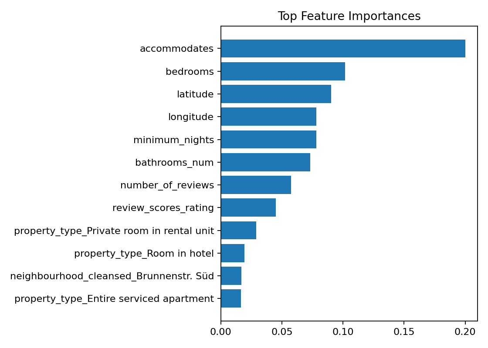
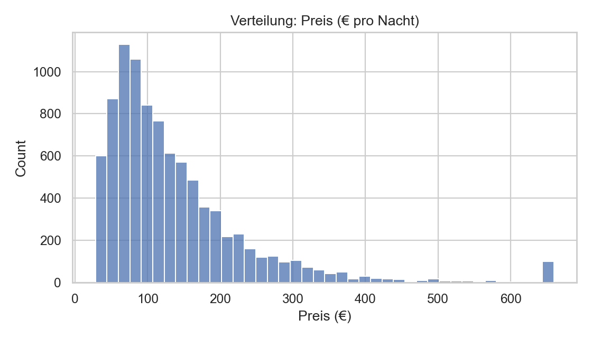

# Airbnb Berlin — Preis & Nachfrage-Analyse

Dieses Projekt zeigt, wie man **Airbnb-Daten für Berlin** bereinigt, analysiert und ein **Machine-Learning-Modell** zur **Preisvorhersage** erstellt.  
Das Ziel: **Faktoren verstehen, die Preise und Nachfrage (Proxy: 90-Tage-Unverfügbarkeitsrate) beeinflussen** → Insights für Revenue-per-Available-Room (RevPAR).

---

## 🔹 Daten
Quelle: [InsideAirbnb](http://insideairbnb.com/get-the-data/)  
- **Listings**: Merkmale wie Preis, Room Type, Location, Reviews  
- **Kalender**: Verfügbarkeit 90 Tage im Voraus  
- **Hinweis**: *"unavailable"* = entweder gebucht **oder** Host-Block → Demand-Proxy, nicht perfekt  

---

## 🔹 Vorgehen
1. **Exploration (01_peek)** → Daten laden, erste Checks  
2. **Bereinigung (02_clean)** → Preise, Ausreißer, Duplikate, NAs  
3. **Feature Engineering (03_demand)** → 90-Tage Unverfügbarkeitsrate  
4. **Modellierung (04_model)** → RandomForest, Train/Test-Split, Metriken, Feature Importances  
5. **Visualisierung & Report (05_report)** → Histogramme, Boxplots, Korrelationen, Business-Fazit  

---

## 🔹 Ergebnisse
- **MAE:** €XX.XX  
- **R²:** 0.XX  
- **Wichtigste Preistreiber:** Room Type, Nachbarschaft, Kapazität  

---

## 🔹 Insights
- **Entire Home/Apt** = deutlicher Preisaufschlag ggü. Private Room  
- **Top-Nachbarschaften** zeigen klare Unterschiede im Medianpreis  
- **Kapazität** korreliert stark mit Preis; **Review Score** eher schwach positiv  

---

## 🔹 Repo-Struktur
```
data/
  raw/         # Originaldaten (nicht versioniert)
  processed/   # clean.csv, merged.csv
notebooks/     # 01_peek → 05_report
reports/figures/
src/           # Modell-Artefakte (lokal, .gitignore)
```

---

## 🔹 Wie starten
```bash
pip install -r requirements.txt

# Workflow (in VS Code oder Jupyter):
# 01_peek → 02_clean → 03_demand → 04_model → 05_report
```


---

## 🔹 Screenshots
  

